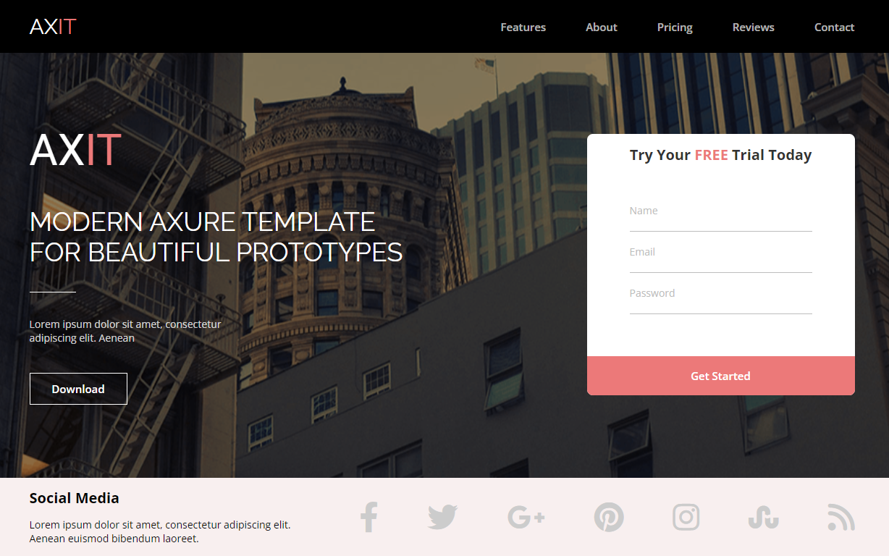

# 
AXIT

  
Навигация

  <ol>
    <li><a href="#about-the-project">О проекте</a></li>
    <li><a href="#built-with">Примененные технологии</a></li>
    <li><a href="#contact">Контакты</a></li>
  </ol>

## <a id="about-the-project">О проекте</a>

Этот проект был первым шагом в моем обучении. Простой одностраничный сайт, написан используя HTML и CSS, чтобы углубиться в эти технологии.

 
  

    <a href="https://yauhiry.github.io/FE38-Landing-Yauheni-Hirynski/">Смотреть демо</a>
  

(<a href="#readme-top">наверх</a>)

## <a id="built-with">Примененные технологии</a>

[![HTML5][HTML5-shield]][HTML5-url]
[![CSS3][CSS3-shield]][CSS3-url]

(<a href="#readme-top">наверх</a>)

## <a id="contact">Контакты</a>

Евгений Гиринский - yauhiry@gmail.com

Ссылка на проект: [https://github.com/Yauhiry/react-budget-app](https://github.com/Yauhiry/FE38-Landing-Yauheni-Hirynski)

[![LinkedIn][linkedin-shield]][linkedin-url]

(<a href="#readme-top">наверх</a>)

[HTML5-shield]: https://img.shields.io/badge/html5-%23E34F26.svg?style=for-the-badge&logo=html5&logoColor=white
[HTML5-URL]: https://html.spec.whatwg.org/multipage/
[CSS3-shield]: https://img.shields.io/badge/css3-%231572B6.svg?style=for-the-badge&logo=css3&logoColor=white
[CSS3-URL]: https://www.w3.org/Style/CSS/
[linkedin-shield]: https://img.shields.io/badge/LinkedIn-0077B5?style=for-the-badge&logo=linkedin&logoColor=white
[linkedin-url]: https://www.linkedin.com/in/hirynski/
